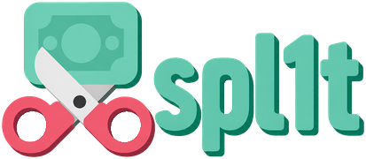

[](https://spl1t.pages.dev)

**spl1t** is an open source expense-tracking app based on [Spliit](https://github.com/spliit-app/spliit). This fork deploys on **Cloudflare Workers** (via OpenNext) with **Cloudflare KV** as the database — not Vercel Postgres / Prisma.

**Live:** [https://spl1t.pages.dev](https://spl1t.pages.dev)

> `spl1t.pages.dev` is a Pages project that reverse-proxies Worker `spl1t`. OpenNext still deploys the Worker. App `NEXT_PUBLIC_BASE_URL` remains `https://spl1t.USER.workers.dev` until a Worker rebuild.

## Features

Legend: 🟢 from original [Spliit](https://github.com/spliit-app/spliit) · 🔴 new in this Cloudflare KV fork

- [x] 🟢 Create a group and share it with friends
- [x] 🟢 Create expenses with description
- [x] 🟢 Display group balances
- [x] 🟢 Create reimbursement expenses
- [x] 🟢 Progressive Web App (**Spl1t** home-screen name; service worker + offline page + update prompt)
- [x] 🟢 Select all/no participant for expenses
- [x] 🟢 Split expenses unevenly
- [x] 🟢 Mark a group as favorite
- [x] 🟢 Tell the application who you are when opening a group
- [x] 🟢 Assign a category to expenses
- [x] 🟢 Search for expenses in a group
- [x] 🟢 Export a group to JSON or CSV
- [x] 🔴 Import a group from a Spliit JSON export (creates a **new** group with remapped IDs)
- [x] 🔴 Import a group from a **Tricount** GDPR CSV or **Splitwise** CSV export (participants + expenses)
- [x] 🔴 Notes + activity history + **document links** in JSON export/import (`exportVersion: 3`)
- [x] 🔴 Copy an existing expense into a new draft
- [x] 🔴 Math expressions in the amount field
- [x] 🔴 Even-split cent remainder (no missing cents)
- [x] 🔴 Group default split mode
- [x] 🔴 Optional group PIN
- [x] 🔴 Share group via QR code
- [x] 🔴 Soft-delete / restore groups (30-day grace) + **24-month inactivity expiry**
- [x] 🔴 Security headers, CSV formula escape, Zod input caps, expense date bounds
- [x] 🔴 Error boundaries + Drawer accessibility titles
- [x] 🔴 Paste-friendly amount parsing (US/EU grouped currency)
- [x] 🔴 Keyboard navigation restored in category/currency selectors
- [x] 🔴 Mobile group tab icons
- [x] 🔴 **Stats:** period selector, summary, spending over time / by participant / by category, recurring estimate, drill-downs, monthly stacked chart, and **balance timeline**
- [x] 🔴 Global balance across groups on My groups
- [x] 🔴 Settle reimbursements in a currency other than the group’s
- [x] 🔴 Unified share math (balances, stats, CSV, and the expense form agree)
- [x] 🔴 Locale-aware week grouping on expenses and activity
- [x] 🔴 Translated page titles
- [x] 🔴 CSV export as per-expense saldo (reimbursements as Cost=0)
- [x] 🔴 Optional calendar-month expense grouping
- [x] 🔴 Drag-reorder / Sort A–Z participants
- [x] 🔴 Multiple payers per expense (legacy single paidById migrated on read)
- [x] 🔴 Extra currencies: **ARS**, **TRY**, **COP**, **JOD**, **MKD**, **MOP**, **MYR**, **VND**
- [ ] ❌ Upload and attach images to expenses (removed — see below)
- [ ] ❌ Create expense by scanning a receipt (removed — see below)

## Stack

- [Next.js](https://nextjs.org/) for the web application
- [TailwindCSS](https://tailwindcss.com/) for the styling
- [shadcn/UI](https://ui.shadcn.com/) for the UI components
- [Cloudflare KV](https://developers.cloudflare.com/kv/) for persistence (denormalized group documents)
- [OpenNext Cloudflare](https://opennext.js.org/cloudflare) + [Workers](https://developers.cloudflare.com/workers/) for hosting

## Data model notes

- Each group is stored as a single KV value under `group:{groupId}`.
- Categories are seeded under the `categories` key.
- Concurrent edits to the same group use **last-write-wins** (no Durable Objects / transactions).
- Friend-sized groups fit this model; very large groups may hit KV value size limits.
- Groups track `lastActivityAt` on expense create/update/delete and group settings updates. After **24 months** without activity, cleanup soft-deletes them; soft-deleted groups can be restored for **30 days**, then are hard-deleted. Call `GET/POST /api/cron/cleanup-groups` with `Authorization: Bearer $CRON_SECRET` (set `CRON_SECRET` in Worker env).

## Extra UX (this fork)

Ideas below track community demand from [Spliit Cloud’s roadmap](https://github.com/antonio-ivanovski/spliit-cloud/blob/main/ROADMAP.md), upstream Spliit issues/PRs, and hardening patterns from [anon-spliit](https://github.com/sora-grayscale/anon-spliit) (reimplemented for KV — not a code port of their E2EE/auth stack).

| Feature | Notes | Prior art |
| --- | --- | --- |
| **Copy expense** | From the expense list or edit header icon (opens create prefilled). | Upstream [#527](https://github.com/spliit-app/spliit/issues/527); shipped in Spliit Cloud |
| **Amount math** | Expressions in the amount field (`10+5.50`, `5*8`, …) on blur/save. | Upstream [#184](https://github.com/spliit-app/spliit/pull/184); shipped in Spliit Cloud |
| **Default split mode** | Stored on the group (device localStorage can still override). | Upstream [#366](https://github.com/spliit-app/spliit/pull/366); shipped in Spliit Cloud |
| **Even-split cents** | Integer remainder allocation so balances don’t drop a cent. | Upstream [#374](https://github.com/spliit-app/spliit/issues/374) / [#427](https://github.com/spliit-app/spliit/pull/427); tracked by Spliit Cloud |
| **Share QR** | QR in the share popover. | Upstream [#500](https://github.com/spliit-app/spliit/pull/500); on Spliit Cloud roadmap |
| **Optional group PIN** | 4–8 digits; unlocks per browser session; hashed on the server, not returned to clients. | Upstream [#373](https://github.com/spliit-app/spliit/issues/373); on Spliit Cloud roadmap |
| **Notes + history + document links in JSON** | Export/import round-trips expense notes, group information, activity history, and document **URLs** (`exportVersion: 3`). | Follow-up to upstream [#546](https://github.com/spliit-app/spliit/pull/546); expense notes also in [#165](https://github.com/spliit-app/spliit/pull/165) |
| **Soft-delete + inactivity expiry** | Manual soft-delete with 30-day restore; auto soft-delete after 24 months without activity; cron hard-deletes after grace. | Inspired by [anon-spliit](https://github.com/sora-grayscale/anon-spliit) deletion/auto-delete work and upstream [#420](https://github.com/spliit-app/spliit/pull/420) |
| **Paste amount parsing** | Normalizes pasted US/EU currency amounts in number fields. | Upstream [#531](https://github.com/spliit-app/spliit/pull/531) |
| **Selector keyboard nav** | Category/currency pickers use cmdk CommandList. | Upstream [#491](https://github.com/spliit-app/spliit/pull/491) |
| **Mobile tab icons** | Icon-only tabs on small screens; labels from sm. | Upstream [#539](https://github.com/spliit-app/spliit/pull/539) |
| **Monthly spending + balance timeline** | CSS stacked category charts, category breakdown, and balance timeline on Stats. | Upstream [#532](https://github.com/spliit-app/spliit/pull/532) / [#555](https://github.com/spliit-app/spliit/pull/555) |
| **Stats cards + drill-downs** | Period selector, summary, spending over time / participant / category, recurring estimate, click-a-bar expense lists. | Upstream [#584](https://github.com/spliit-app/spliit/pull/584) / [#586](https://github.com/spliit-app/spliit/pull/586) |
| **Global balance** | Net across visited groups on My groups, bucketed by currency. | Upstream [#583](https://github.com/spliit-app/spliit/pull/583) |
| **Settle in another currency** | Reimbursements can show the transfer amount in a non-group currency; group amount stays authoritative. | Upstream [#588](https://github.com/spliit-app/spliit/pull/588) |
| **Unified share math** | One apportionment for balances, stats, CSV, and the form (Hamilton remainder). | Upstream [#562](https://github.com/spliit-app/spliit/pull/562) |
| **Locale week start** | Expense/activity “this week” follows the UI locale, not Sunday. | Upstream [#559](https://github.com/spliit-app/spliit/pull/559) |
| **PWA service worker** | Offline shell + update Reload toast; never caches API or mutations. Home-screen name **Spl1t**. | Upstream [#587](https://github.com/spliit-app/spliit/pull/587) |
| **Splitwise import** | CSV reconstruction (EN/DE headers) via the same Import control. | Upstream [#483](https://github.com/spliit-app/spliit/pull/483) |
| **CSV saldo export** | Participant columns are per-expense saldo; reimbursements Cost=0. | Upstream [#473](https://github.com/spliit-app/spliit/pull/473) |
| **Translated page titles** | `generateMetadata` + next-intl on group pages. | Upstream [#537](https://github.com/spliit-app/spliit/pull/537) |
| **Calendar month grouping** | Optional group setting for roommate-style monthly lists. | Upstream [#530](https://github.com/spliit-app/spliit/pull/530) |
| **Multiple payers** | Split who paid an expense across several participants; balances/export/import aware. Legacy paidById migrates on read. | Upstream [#396](https://github.com/spliit-app/spliit/pull/396) |
| **Reorder participants** | Drag-and-drop + Sort A–Z; order persisted in KV. | Upstream [#416](https://github.com/spliit-app/spliit/pull/416) |
| **Tricount import** | GDPR CSV export via the same Import control as Spliit JSON. | Upstream [#526](https://github.com/spliit-app/spliit/pull/526) |
| **Export / input hardening** | CSV formula escape, Zod max caps, expense date bounds, security headers, error boundaries. | Patterns reviewed from [anon-spliit](https://github.com/sora-grayscale/anon-spliit) (adapted for Workers/KV) |

## Stats (this fork)

On each group’s **Stats** tab:

- **Period** — all time, this month, last 30 days, this year, or a custom from/to range.
- **Summary / spending over time / by participant / by category / recurring** — same cards as upstream [#584](https://github.com/spliit-app/spliit/pull/584); bars drill into the expenses behind them ([#586](https://github.com/spliit-app/spliit/pull/586)).
- **Monthly spending** — stacked category chart for calendar months, with a category breakdown and legend controls.
- **Balance timeline** — cumulative balances over time for participants (engineering fixes on this fork for share math / timeline consistency).

Spending stats exclude reimbursements. Inspired by upstream [#532](https://github.com/spliit-app/spliit/pull/532) / [#555](https://github.com/spliit-app/spliit/pull/555) / [#584](https://github.com/spliit-app/spliit/pull/584); reimplemented for denormalized KV documents.

## Group import JSON / Tricount / Splitwise (this fork)

On the **Groups** page, use **Import JSON** to upload:

1. A **Spliit JSON** export (this fork or upstream Spliit), or
2. A **Tricount** personal-data / GDPR **CSV** export, or
3. A **Splitwise** **CSV** export (English or German headers).

The format is detected automatically.

Shared behavior:

- Always creates a **new** group (does not overwrite an existing one).
- Regenerates group, participant, and expense IDs so imports never collide with live data.
- Does **not** import a group PIN (PIN must be set again after import).

### Spliit JSON

- Restores participants, expenses (including **multiple payers** when present), split modes, amounts, dates, **notes**, group **information**, and **activity history** (when present in the file).
- Categories: match by `id` when present; otherwise by `name` / `grouping` against the seeded list (many exports omit `id`).
- Newer exports include `exportVersion: 3`, expense `id`s (needed to re-link history), and expense **document links** (`url` / dimensions — not file bytes).
- Document URLs round-trip for migration between Spliit forks; binaries are not embedded, and links may 404 if the original storage expires. Recurring-expense links are still not restored.

### Tricount CSV

- Imports participants and expenses (amounts by share / impacted amounts).
- Uses the CSV default currency (Frankfurter `.dev` for missing cross-rates).
- Notes and activity history are Spliit-only; Tricount imports leave them empty.
- Prior art: upstream [#526](https://github.com/spliit-app/spliit/pull/526).

### Splitwise CSV

- Reconstructs expenses from Splitwise’s balance-delta CSV so resulting **balances match** the export (original split mode may be approximated).
- English and German headers/categories; other Splitwise UI languages: switch Splitwise to English before export.
- Prior art: upstream [#483](https://github.com/spliit-app/spliit/pull/483).

## Removed / disabled upstream features (S3 & OpenAI)

Upstream Spliit optional features that depended on **AWS S3** and **OpenAI** are **not available** in this Cloudflare KV fork:

| Feature                          | Upstream dependency               | Status here                                                                                   |
| -------------------------------- | --------------------------------- | --------------------------------------------------------------------------------------------- |
| Expense document / image uploads | S3 (or compatible object storage) | **Removed** from the critical path; UI/API stubs keep flags off. KV is not used for binaries. |
| Create expense from receipt scan | OpenAI + storage                  | **Disabled**; no OpenAI client or API keys.                                                   |
| Category extract from text/image | OpenAI                            | **Disabled**; same as above.                                                                  |

What changed vs upstream:

- Prisma, Postgres, and Vercel-oriented DB wiring were replaced with the KV group-document API.
- S3/OpenAI packages and env vars were dropped; keep `NEXT_PUBLIC_ENABLE_EXPENSE_DOCUMENTS`, `NEXT_PUBLIC_ENABLE_RECEIPT_EXTRACT`, and `NEXT_PUBLIC_ENABLE_CATEGORY_EXTRACT` unset or `false` (see `.env.example`).
- Re-enabling uploads later would mean adding something like **R2** (not stuffing files into KV). Receipt/category AI would need a Workers-compatible provider and explicit product work.

## Run locally

1. Clone the repository: `git clone https://github.com/t0ma5/spl1t.git`
2. Copy `.env.example` to `.env` and `.dev.vars` as needed
3. Create a KV namespace and put its id in [`wrangler.jsonc`](wrangler.jsonc):

```bash
npx wrangler kv namespace create spl1t-db
npx wrangler kv namespace create spl1t-db --preview
```

4. Run `npm install` (uses `package-lock.json`)
5. Set `NEXT_PUBLIC_BASE_URL` (production default in `wrangler.jsonc` `vars` is `https://spl1t.pages.dev`)
6. Run `npm run dev` for Next.js local development (bindings via OpenNext), or `npm run preview` to build and run in the Workers runtime

**Note:** Local OpenNext/Wrangler needs **workerd**, which does **not** support Windows ARM64. On those machines, develop against the remote Worker or deploy from an x64/Linux host.

## Deploy to Cloudflare

Deploy **directly** to Cloudflare (no GitHub Actions).

Requires **Node.js 22+** and a host where Wrangler/workerd runs (Linux / macOS / Windows x64 — not Windows ARM64).

```bash
npm run deploy
```

This runs `opennextjs-cloudflare build` then deploys Worker **`spl1t`**. Ensure:

- `DB` KV binding in `wrangler.jsonc` points at your namespace (existing id kept so group data survives).
- `vars.NEXT_PUBLIC_BASE_URL` matches the URL users open (`https://spl1t.pages.dev`).

### Ops notes

- Pushing code to GitHub does **not** update the live Worker until you run `npm run deploy` (or equivalent OpenNext/Wrangler upload) against Cloudflare.
- Prefer `git` / GitHub CLI over the GitHub web “upload files” UI — uploads often drop directories.
- Set Worker secret `CRON_SECRET` and schedule a daily call to `/api/cron/cleanup-groups` for inactivity cleanup.

## Health check

- `GET /api/health/readiness` or `GET /api/health` — app ready, including KV connectivity
- `GET /api/health/liveness` — process alive only

## Credits & provenance

- **Original Spliit** — idea, UI, and core expense-splitting product by [Sebastien Castiel](https://github.com/scastiel) and contributors: [spliit-app/spliit](https://github.com/spliit-app/spliit) · [spliit.app](https://spliit.app).
- **[Spliit Cloud](https://spliit.cloud)** ([antonio-ivanovski/spliit-cloud](https://github.com/antonio-ivanovski/spliit-cloud)) — community fork that continues Spliit with new features. Several UX improvements in *this* Workers/KV fork were prioritized from their [roadmap](https://github.com/antonio-ivanovski/spliit-cloud/blob/main/ROADMAP.md) and upstream issue links (reimplemented for denormalized KV documents, not a code port of their Postgres/API stack).
- **[anon-spliit](https://github.com/sora-grayscale/anon-spliit)** ([sora-grayscale](https://github.com/sora-grayscale)) — privacy-focused fork (E2EE, private instance, deletion/auto-delete). This Workers/KV fork adapted selected **lifecycle and hardening** ideas from that work; it does **not** port their end-to-end encryption or account/2FA stack.

## License

MIT, see [LICENSE](./LICENSE). Same license family as upstream Spliit and Spliit Cloud; retain their copyright notices where applicable.
